# STA302 Currency-Hedge Effectiveness / STA302 货币对冲有效性研究

Private, reproducible course project studying whether the daily return spread between HEWJ and EWJ behaves like a yen hedge, and whether that relationship changed after the COVID-19 break.

本仓库是一个私有、可复现的 STA302 课程项目，用于研究 HEWJ 与 EWJ 的日度收益差是否体现日元对冲效果，以及这种关系在 COVID-19 断点后是否发生变化。

## Headline results / 核心结果

| Item / 指标 | Result / 结果 |
|---|---:|
| Exact-interval daily observations / 同期日度观测 | 2,655 |
| Sample / 样本区间 | 2014-02-06 to 2026-07-31 |
| Full-model R² / 完整模型 R² | 0.703819 |
| Pre-period yen slope / 疫情前日元斜率 | -0.850936 |
| Yen x Post / 日元 x 疫情后交互项 | -0.061206 |
| Interaction p, classical / 经典 p 值 | 0.00931 |
| Interaction p, HAC(5) / HAC(5) p 值 | 0.10439 |
| Implied post-period slope / 疫情后隐含斜率 | -0.912143 |
| Dimson cumulative post exposure / Dimson 疫情后累计暴露 | -0.994105; HAC(22) CI [-1.03465, -0.95356] |
| Weekly common-date post exposure / 周度共同日期疫情后暴露 | -0.986328; CI [-1.01568, -0.95697] |
| Selected predictive model / 最终预测模型 | FX interaction / 汇率交互模型 |
| Rolling-origin mean RMSE / 滚动验证平均 RMSE | 0.26665 |
| Held-out test RMSE / 留出测试 RMSE | 0.3159 vs 0.6532 mean benchmark |
| Quadratic terms, HAC(5) joint p / 二次项联合 p 值 | 0.02880 |
| Yeo-Johnson lambda / Yeo-Johnson 参数 | 1.00 on development data |
| Break-window interaction p / 断点窗口交互 p 值 | 0.03028–0.15997 |
| Test response SD, log vs arithmetic / 测试波动标准差 | 0.65378 vs 0.65316 |

The pandemic interaction is significant with conventional OLS standard errors but not with Newey-West HAC(5). Same-date slopes differ from -1, but Dimson lead/current/lag and weekly common-date cumulative exposures are statistically compatible with -1. Therefore incomplete hedging applies to the same-date specification, not unconditionally to cumulative exposure. The break is associational, not causal.

疫情交互项在经典 OLS 标准误下显著，但使用 Newey-West HAC(5) 后不显著。同日模型斜率显著不同于 -1，但 Dimson 前一期/当期/后一期累计暴露和周度共同日期暴露与 -1 相容。因此“不完全对冲”只适用于同日设定，不能无条件推广到累计暴露；断点只作相关性解释。

The nonlinear, influence, and break-date analyses are now complete. The
interaction remains negative, but its 5% significance changes under
winsorization, Cook's-distance deletion, and alternative declared break dates.
The same-date model indicates incomplete exposure, while clock-corrected cumulative
exposure is close to -1; a discrete pandemic change is not stable across reasonable specifications.

非线性、影响点、断点日期与市场时钟分析均已完成。同日模型显示不完全暴露，但时钟
修正后的累计暴露接近 -1；交互项显著性会随合理设定改变，不能稳健声称疫情造成了
离散结构变化。

## Strict workflow / 严格实验流程

1. Each price series is converted to a log return on its own native calendar before merging.
2. The primary sample keeps rows sharing the same calendar return start and end dates. A separate audit records each source's native time zone and observation clock; it does not pretend that New York noon, U.S. close, and Tokyo close are the same instant.
3. The full inferential model is fitted first with `JPY_app * Post`, Nikkei return, SMB, HML, RMW, CMA, MOM, VIX change, and the lagged rate differential. Because residuals are not iid, primary inference uses Newey-West HAC(5), with HAC(1) and HAC(10) sensitivity checks.
4. Prediction is secondary and uses expanding-window rolling-origin validation. Models trained through 2020, 2021, and 2022 are validated on 2021, 2022, and 2023. Mean validation RMSE selects the FX-interaction model; it is refit through 2024-01-23 and evaluated on data held out from fitting and selection.
5. A quadratic yen model and a Yeo-Johnson response use the same folds; Yeo-Johnson lambda selection occurs inside each fold, and neither analysis reopens the final test choice.
6. The primary model keeps all valid observations. Winsorization and Cook's-distance deletion are labelled sensitivity/stress tests, not replacements chosen by significance.
7. March 6, March 11, and March 16, 2020 are evaluated as a declared break window without selecting the lowest p-value.
8. No random shuffling, test-set tuning, or stochastic training is used. OLS is deterministic, so repeated random seeds are not applicable.
9. Market-clock risk is tested with Dimson lag/current/lead cumulative exposure, HAC(5)/HAC(22), and a last-common-date weekly model. FX leads are diagnostic only and never enter prediction.
10. The complete workflow is rerun with exact arithmetic returns; this directly tests whether log returns suppress test volatility.

The held-out exercise measures conditional fit using same-day observed predictors; it is not an ahead-of-time trading forecast.

对应中文：各价格序列先独立计算收益，再做严格同期合并；先拟合全变量模型并用 OLS 系数加 Newey-West 标准误完成核心推断；预测采用扩展窗口 rolling-origin，以 2021、2022、2023 为连续验证年，按平均 RMSE 选出汇率交互模型，2024-01-24 之后的测试集不参与选模。
这里检验的是使用当日已观测变量的样本外条件拟合，不是提前预测未来收益的交易策略。

| Split / 数据集 | Rows / 行数 | Dates / 日期 | Purpose / 用途 |
|---|---:|---|---|
| Development | 2,124 | 2014-02-06–2024-01-23 | Three rolling-origin folds, then final refit / 三折滚动验证后重拟合 |
| Test | 531 | 2024-01-24–2026-07-31 | One final evaluation / 一次最终评估 |

## Visual results / 结果可视化

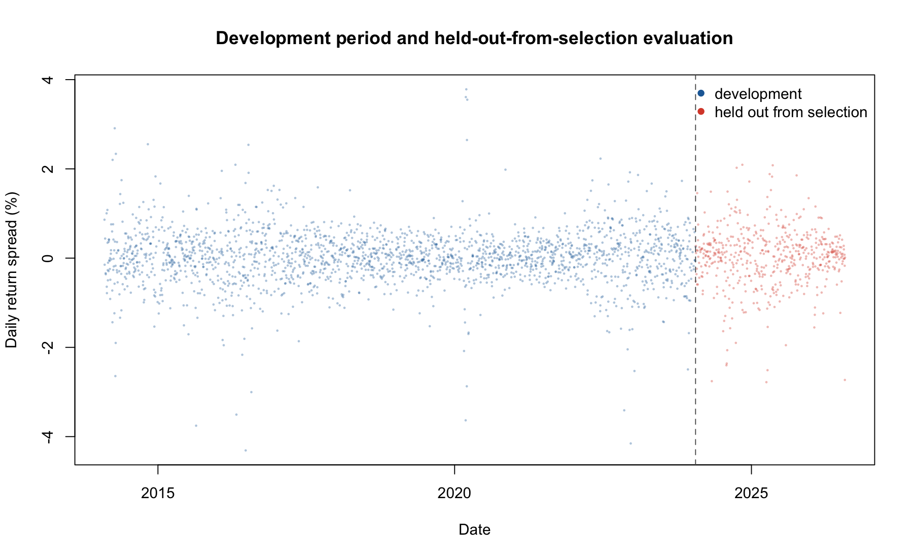

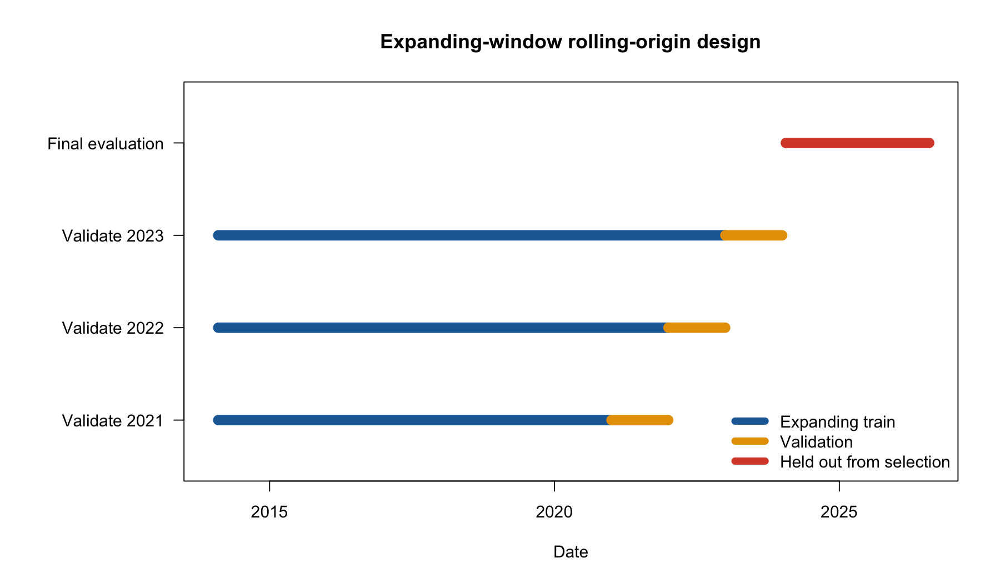

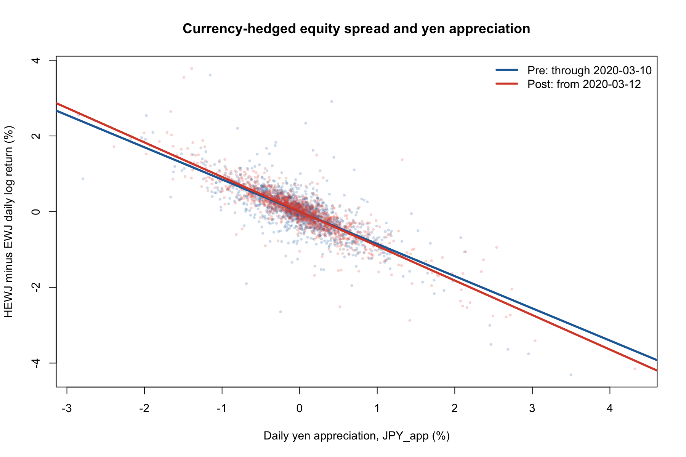


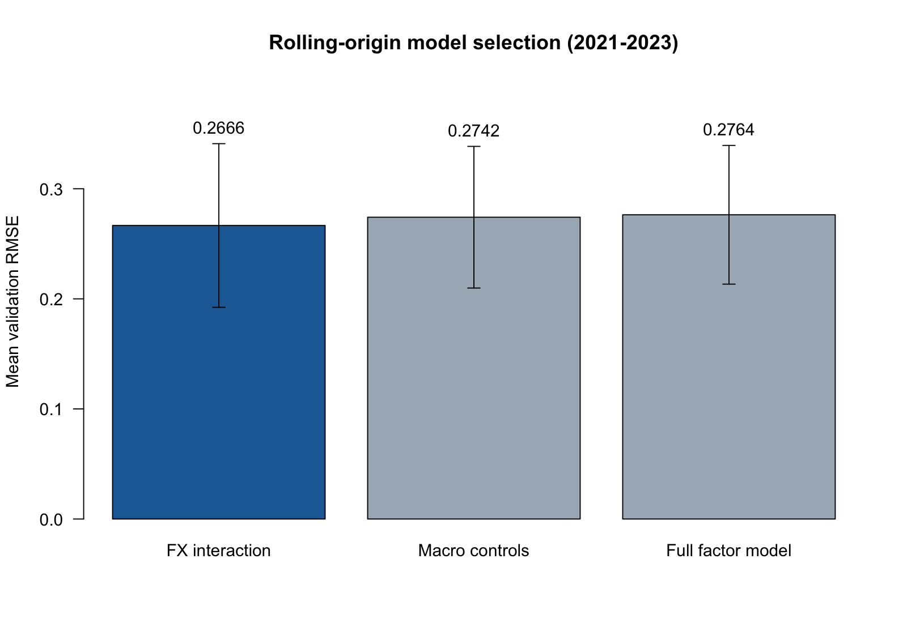

### Candidate-specific validation figures / 各候选模型独立验证图

The three candidates are also saved as separate files in `figures/prediction/`, using the
same vertical scale and showing every validation-year RMSE plus the three-fold
mean. This separates the initial full model from the two reduced alternatives
while preserving a directly comparable presentation.

三个候选模型同时以独立文件保存在 `figures/prediction/` 中，纵轴范围一致；每张图均展示三个
验证年度的 RMSE 和三折平均值，因此可以分别检查初始完整模型和两个精简模型。

**FX interaction / 汇率交互模型（最终选中）**

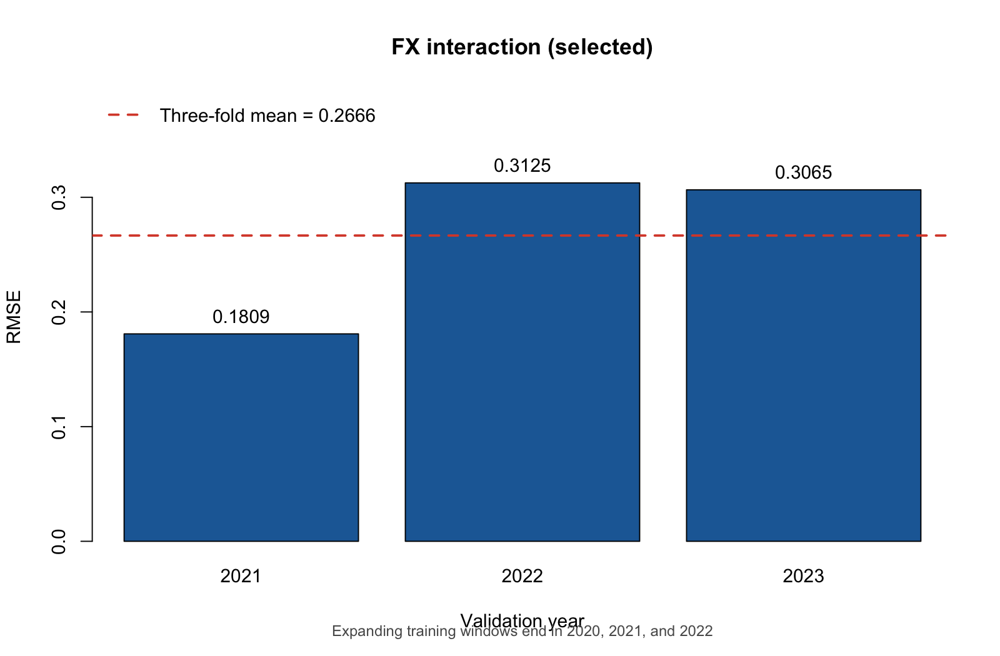

**Macro controls / 宏观控制模型**

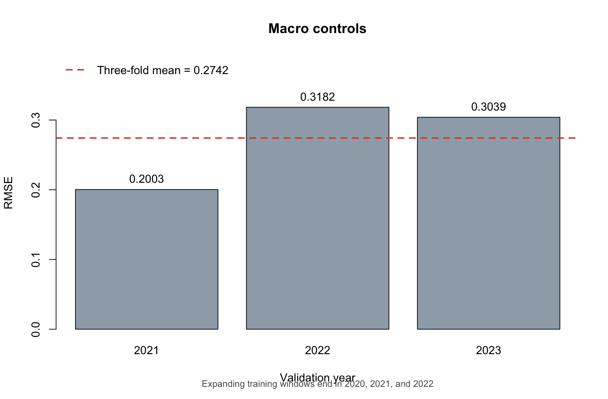

**Full factor model / 初始完整因子模型**

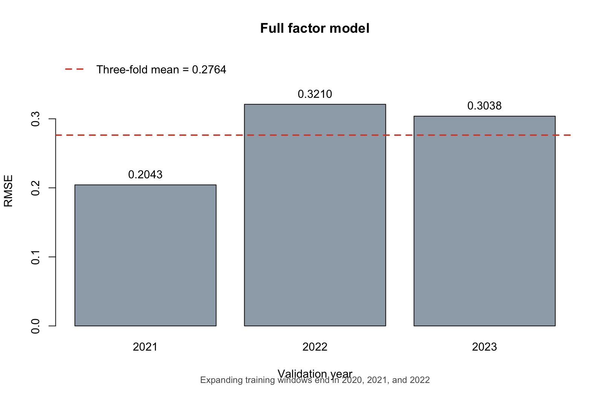

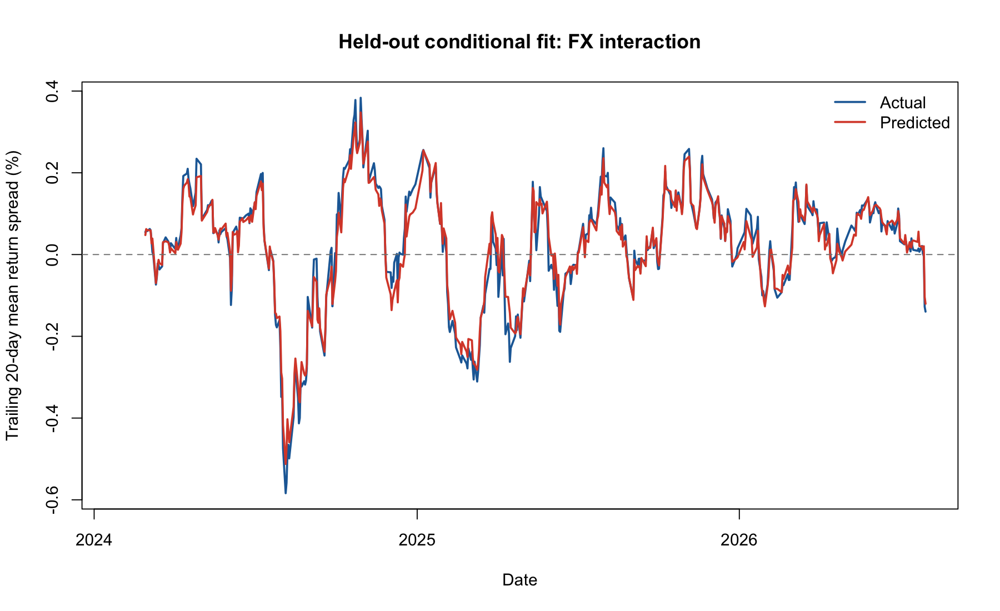

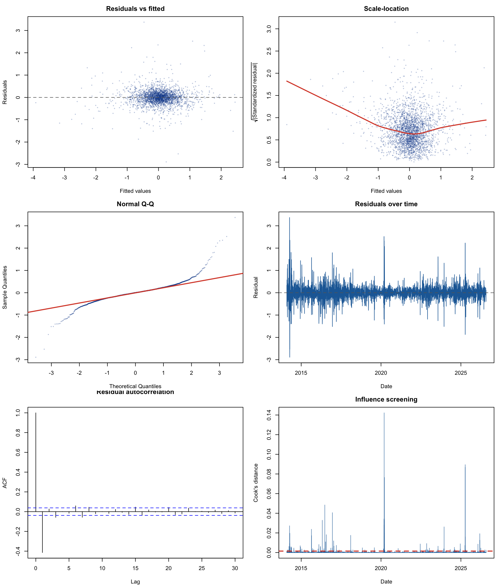

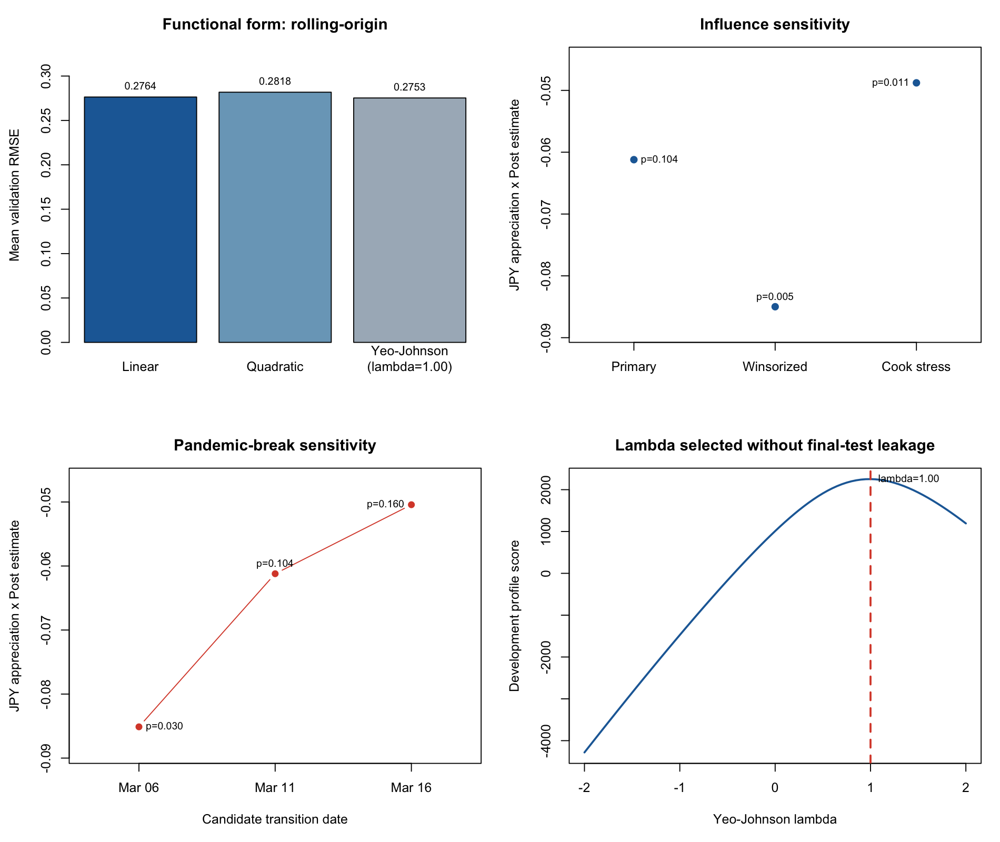

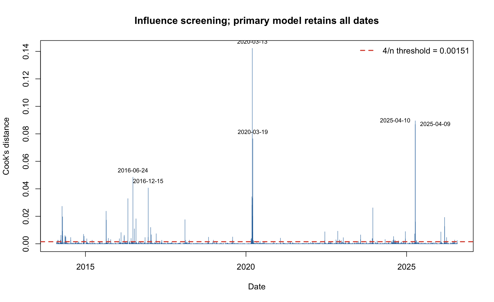

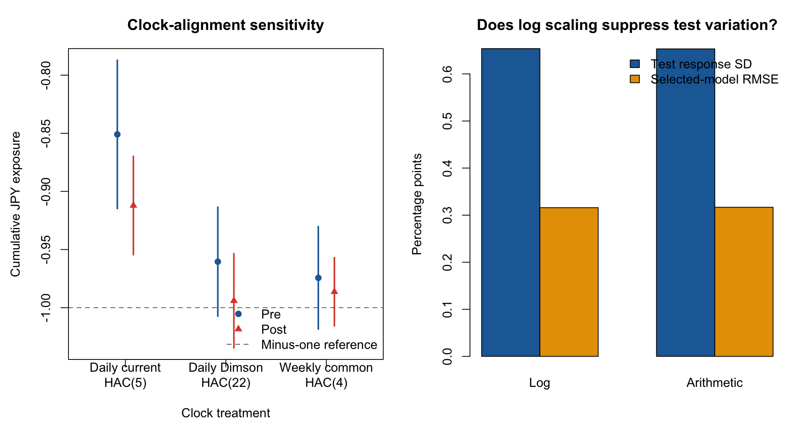

## Repository architecture / 仓库架构

```text
.
├── code/                               # all executable source code
│   ├── README.md                       # what every code file does
│   ├── analysis/                       # statistical analysis and standalone Rmd
│   ├── pipeline/                       # build, packaging and validation scripts
│   └── tests/                          # end-to-end assertions
├── data/
│   ├── README.md                       # data directory guide
│   ├── raw/                            # frozen source snapshots + SHA-256
│   ├── original_csv/                   # deterministic CSV exports of all sources
│   ├── DATA_DICTIONARY.csv             # processed-field definitions
│   ├── TIME_ALIGNMENT.csv/.md           # time zones, market clocks, interval policy
│   ├── SOURCE_MANIFEST.csv             # machine-readable source provenance
│   └── processed/                      # cleaned modeling table
├── results/                            # machine-readable experiment results
│   ├── inference/                      # coefficients, tests and diagnostics
│   ├── prediction/                     # rolling selection and final test
│   ├── robustness/                     # sensitivity analyses
│   ├── audit/                          # quality checks, logs and hashes
│   ├── models/                         # fitted R objects
│   └── README.md                       # exact result-file index
├── figures/                            # generated visual evidence
│   ├── inference/                      # slope and coefficient figures
│   ├── prediction/                     # split, validation and test figures
│   ├── diagnostics/                    # residual and sensitivity figures
│   └── README.md                       # exact figure-file index
├── reports/                            # human-readable reports and PDFs
│   ├── README.md                       # report index
│   ├── analysis/                       # final findings and rendered HTML
│   ├── proposal/                       # proposal sources and three PDFs
│   └── submission/                     # submission instructions
├── config/
│   ├── README.md                       # how the protocol is used
│   └── analysis_protocol.yml           # frozen split and inference protocol
├── submission/                         # Quercus-ready staging package
│   ├── README.md                       # package map and handling rules
│   ├── code/                           # standalone Rmd
│   ├── data/original/                  # all source data as CSV
│   ├── data/cleaned/                   # cleaned modeling CSV
│   └── proposal/                       # official English PDF
├── REPRODUCIBILITY.md
└── environment.yml
```

## Reproduce everything / 完整复现

Create the environment in a path without spaces:

```bash
conda env create -p /private/tmp/sta302_r_env -f environment.yml
conda activate /private/tmp/sta302_r_env
```

Run the complete pipeline from the repository root:

```bash
bash code/pipeline/run_all.sh
```

This command:

1. verifies all seven frozen raw-file SHA-256 hashes;
2. exports every original source as CSV with source and export hashes;
3. reruns interval/clock-audited cleaning, OLS, HAC inference, Dimson and weekly clock checks, exact arithmetic-return comparison, diagnostics, nonlinear, influence, break-date, figure, and chronological validation in R;
4. executes end-to-end tests for leakage controls, split order, model-selection lock, sensitivity conclusions, and artifacts;
5. knits the Rmd to a self-contained bilingual HTML report;
6. rebuilds the official English, Chinese, and bilingual proposal PDFs;
7. prepares an all-CSV Quercus staging package;
8. knits the staged CSV-only submission again in an isolated temporary directory;
9. hashes all core research artifacts; and
10. checks the expected rows, dates, coefficients, robustness outputs, Rmd completeness, and PDF text.

该命令会验证七份原始文件、重新运行完整 R 分析、渲染 Rmd、重建中英双语 PDF，并检查关键数值和输出是否一致。

## Primary deliverables / 主要交付物

- `reports/proposal/STA302_Research_Proposal_Official_EN.pdf` - formal English-only course submission.
- `reports/proposal/STA302_Research_Proposal_Official_ZH.pdf` - complete Chinese proposal with tables and figures.
- `reports/proposal/STA302_Bilingual_Research_Proposal.pdf` - English proposal followed by a faithful Chinese study copy.
- `code/analysis/STA302_Project_Analysis.Rmd` - self-contained course submission containing the full cleaning, modeling, table, and diagnostic code.
- `reports/analysis/STA302_Project_Analysis.html` - verified knitted analysis.
- `data/processed/sta302_daily_analysis.csv` - final complete-case modeling table.
- `submission/` - staged PDF, standalone Rmd, original CSV exports/copies, cleaned CSV, checklist, and hashes.
- `results/audit/R_run_log.txt` - R version, package versions, sample and results.
- `reports/analysis/RESULTS_AND_CONCLUSIONS.md` - bilingual methods, tests, limitations, and conclusions.
- `results/prediction/` - rolling validation, locked selection, held-out-from-selection metrics and predictions.
- `results/inference/` - classical and HAC coefficients, hypothesis tests and model diagnostics.
- `results/robustness/` - calendar/clock alignment, return-definition, functional-form, HAC-lag, influence and break-date sensitivity.
- `results/audit/` - row-level audits, run log, data-quality checks and artifact hashes.
- `results/models/models.rds` - fitted models and locked selection metadata.

The proposal PDFs remain the Part 1 proposal and therefore describe the
robustness work as planned. Completed final-project evidence is reported in the
HTML analysis and `reports/analysis/RESULTS_AND_CONCLUSIONS.md`; the original proposal is not
silently rewritten after results are known.

提案 PDF 保留为第一部分提案，因此仍以“计划”表述后续稳健性工作。完成后的最终证据
位于 HTML 分析报告和 `reports/analysis/RESULTS_AND_CONCLUSIONS.md`，不在看到结果后反向改写原提案。

## Data and integrity / 数据与诚信

The repository contains frozen third-party data snapshots for private educational reproducibility. Ownership and usage terms remain with Yahoo Finance, FRED, iShares, and the Kenneth French Data Library. Do not make this repository public until the data-provider terms have been reviewed. See `data/DATA_USE.md` and `data/SOURCE_MANIFEST.md`.

本仓库为了私有教学复现而保存第三方数据快照。数据所有权和使用条款仍属于 Yahoo Finance、FRED、iShares 与 Kenneth French Data Library。在审查各数据源条款前，请勿把仓库改为公开。

## Manual items before course submission / 课程提交前必须人工补充

1. Replace bracketed group-member names and contribution descriptions.
2. Complete and sign the course-provided Group Teamwork Agreement PDF using the same roster and roles.
3. Upload `submission/data/original/` and `submission/data/cleaned/` to UofT OneDrive, verify the required access setting, and paste the link into the Quercus submission comment.

1. 替换所有带方括号的小组成员姓名和贡献说明。
2. 使用相同名单与职责完成并签署课程提供的 Group Teamwork Agreement PDF。
3. 把 `submission/data/original/` 和 `submission/data/cleaned/` 上传至 UofT OneDrive，核验权限后把链接粘贴到 Quercus 提交评论。
