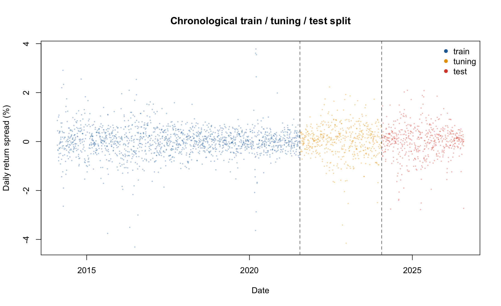
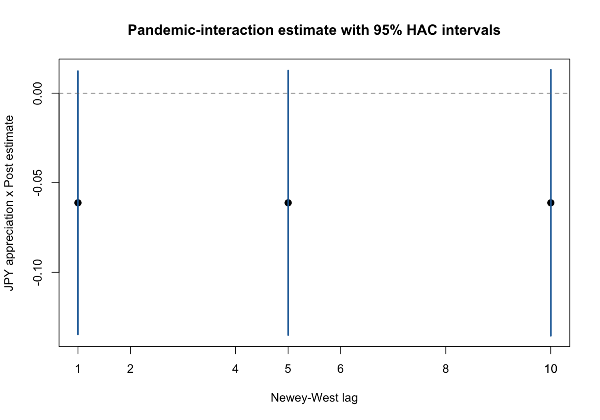
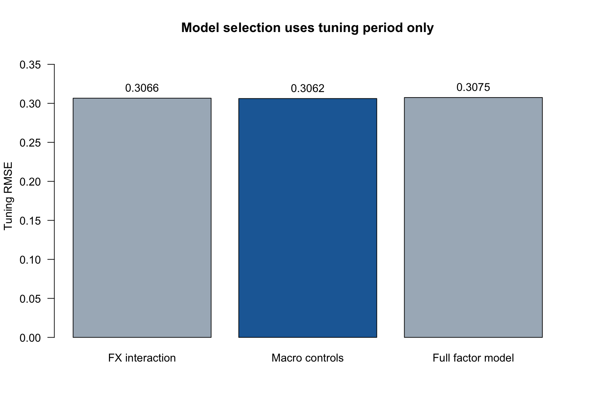
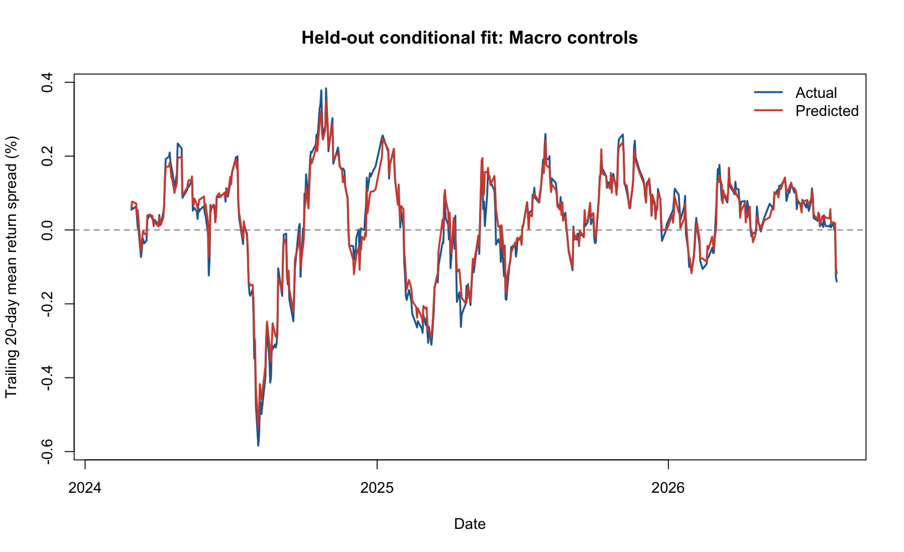
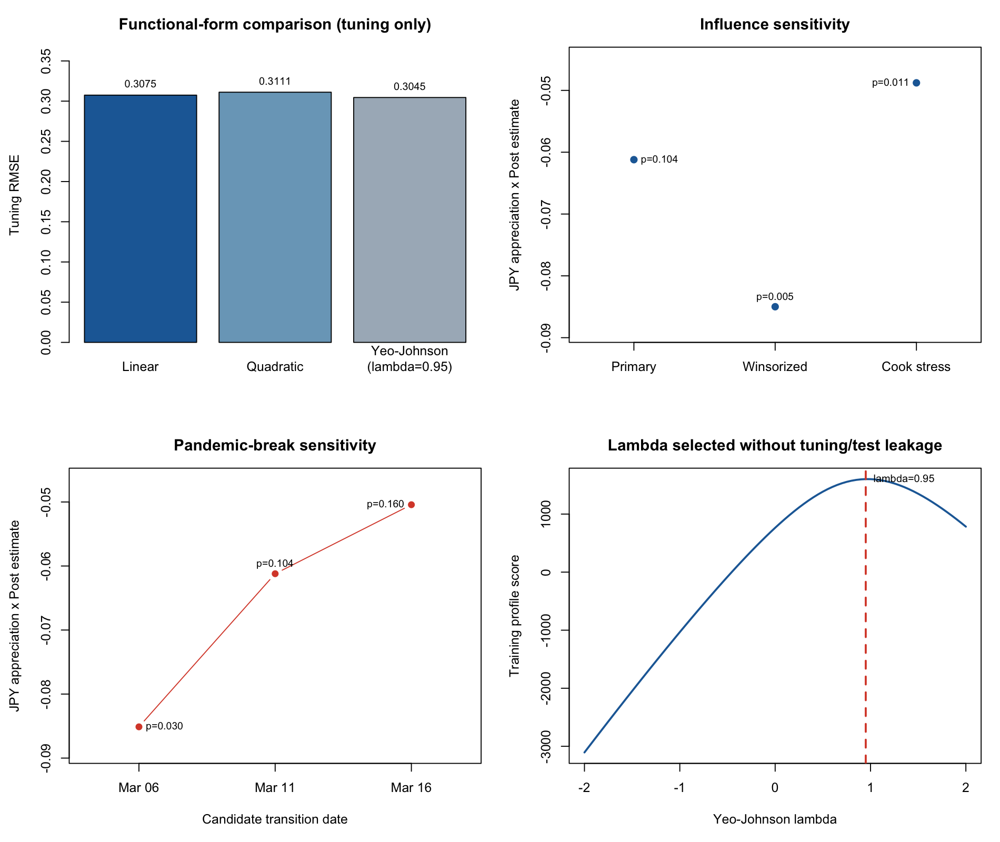

# STA302 Currency-Hedge Effectiveness / STA302 货币对冲有效性研究

Private, reproducible course project studying whether the daily return spread between HEWJ and EWJ behaves like a yen hedge, and whether that relationship changed after the COVID-19 break.

本仓库是一个私有、可复现的 STA302 课程项目，用于研究 HEWJ 与 EWJ 的日度收益差是否体现日元对冲效果，以及这种关系在 COVID-19 断点后是否发生变化。

## Headline results / 核心结果

| Item / 指标 | Result / 结果 |
|---|---:|
| Exact-interval daily observations / 同期日度观测 | 2,655 |
| Sample / 样本区间 | 2014-02-06 to 2026-07-31 |
| Full-model R² / 完整模型 R² | 0.703819 |
| Pre-period yen slope / 疫情前日元斜率 | -0.850936 |
| Yen x Post / 日元 x 疫情后交互项 | -0.061206 |
| Interaction p, classical / 经典 p 值 | 0.00931 |
| Interaction p, HAC(5) / HAC(5) p 值 | 0.10439 |
| Implied post-period slope / 疫情后隐含斜率 | -0.912143 |
| Selected predictive model / 最终预测模型 | Macro controls / 宏观控制模型 |
| Held-out test RMSE / 留出测试 RMSE | 0.3116 vs 0.6532 mean benchmark |
| Quadratic terms, HAC(5) joint p / 二次项联合 p 值 | 0.02880 |
| Yeo-Johnson lambda / Yeo-Johnson 参数 | 0.95, selected on train only |
| Break-window interaction p / 断点窗口交互 p 值 | 0.03028–0.15997 |

The pandemic interaction is significant with conventional OLS standard errors but not with Newey-West HAC(5). Both period-specific slopes remain significantly different from the complete-hedge benchmark of -1 under HAC(5), supporting incomplete hedging in both periods. The break is associational, not causal.

疫情交互项在经典 OLS 标准误下显著，但使用 Newey-West HAC(5) 后不显著。两个时期的斜率在 HAC(5) 下仍显著不同于完全对冲基准 -1，因此支持“两时期均存在不完全对冲”；断点只作相关性解释，不作因果解释。

The nonlinear, influence, and break-date analyses are now complete. The
interaction remains negative, but its 5% significance changes under
winsorization, Cook's-distance deletion, and alternative declared break dates.
The robust conclusion is incomplete hedging in both periods; a discrete pandemic
change is not stable across reasonable specifications.

非线性、影响点与断点日期分析均已完成。交互项方向始终为负，但其 5% 显著性会随
缩尾、Cook 距离删除和备选断点改变。稳健结论是两个时期都存在不完全对冲，不能稳健
声称疫情造成了离散结构变化。

## Strict workflow / 严格实验流程

1. Each price series is converted to a log return on its own native calendar before merging.
2. The primary sample keeps only rows sharing the same return start and end dates across HEWJ/EWJ, USD/JPY, Nikkei 225, and VIX; a same-end-date-only sample is reported separately as sensitivity analysis.
3. The full inferential model is fitted first with `JPY_app * Post`, Nikkei return, SMB, HML, RMW, CMA, MOM, VIX change, and the lagged rate differential. Because residuals are not iid, primary inference uses Newey-West HAC(5), with HAC(1) and HAC(10) sensitivity checks.
4. Prediction is secondary and uses a fixed chronological 60% train / 20% tuning / 20% untouched test split. The predeclared candidates are FX interaction only, macro controls, and the full factor model. Tuning RMSE selects the macro-control model; it is refit on train+tuning and evaluated once on test.
5. A quadratic yen model and a Yeo-Johnson response are evaluated on training/tuning only; the already locked test-set decision is not reopened.
6. The primary model keeps all valid observations. Winsorization and Cook's-distance deletion are labelled sensitivity/stress tests, not replacements chosen by significance.
7. March 6, March 11, and March 16, 2020 are evaluated as a declared break window without selecting the lowest p-value.
8. No random shuffling, test-set tuning, or stochastic training is used. OLS is deterministic, so repeated random seeds are not applicable.

The held-out exercise measures conditional fit using same-day observed predictors; it is not an ahead-of-time trading forecast.

对应中文：各价格序列先独立计算收益，再做严格同期合并；先拟合全变量模型并用 OLS 系数加 Newey-West 标准误完成核心推断；预测采用固定的 60%/20%/20% 时间切分，在三个预设候选模型中由调优 RMSE 选出宏观控制模型，测试集不参与选模。
这里检验的是使用当日已观测变量的样本外条件拟合，不是提前预测未来收益的交易策略。

| Split / 数据集 | Rows / 行数 | Dates / 日期 | Purpose / 用途 |
|---|---:|---|---|
| Train | 1,593 | 2014-02-06–2021-07-20 | Fit candidates / 拟合候选模型 |
| Tuning | 531 | 2021-07-21–2024-01-23 | Select by RMSE / 按 RMSE 选模 |
| Test | 531 | 2024-01-24–2026-07-31 | One final evaluation / 一次最终评估 |

## Visual results / 结果可视化














## Repository architecture / 仓库架构

```text
.
├── analysis/
│   ├── run_analysis.R                  # complete deterministic R pipeline
│   └── STA302_Project_Analysis.Rmd     # course-facing reproducibility entry
├── data/
│   ├── raw/                            # frozen source snapshots + SHA-256
│   ├── original_csv/                   # deterministic CSV exports of all sources
│   ├── DATA_DICTIONARY.csv             # processed-field definitions
│   ├── SOURCE_MANIFEST.csv             # machine-readable source provenance
│   └── processed/                      # cleaned modeling table
├── docs/proposal/
│   ├── STA302_Research_Proposal_EN.md  # official English proposal
│   └── STA302_Research_Proposal_ZH.md  # aligned Chinese translation
├── figures/                            # generated figures
├── results/                            # coefficients, diagnostics, validation, RDS
├── tests/test_pipeline.R               # end-to-end assertions
├── config/analysis_protocol.yml        # frozen split and inference protocol
├── scripts/
│   ├── build_bilingual_proposal_pdf.py
│   ├── prepare_submission_package.py
│   ├── test_submission_package.py      # isolated CSV-only knit test
│   ├── run_all.sh
│   └── validate_outputs.py
├── output/
│   ├── STA302_Project_Analysis.html
│   └── pdf/
│       ├── STA302_Research_Proposal_Official_EN.pdf
│       ├── STA302_Research_Proposal_Official_ZH.pdf
│       └── STA302_Bilingual_Research_Proposal.pdf
├── submission/                         # Quercus-ready staging package
│   ├── code/                           # standalone Rmd
│   ├── data/original/                  # all source data as CSV
│   ├── data/cleaned/                   # cleaned modeling CSV
│   └── proposal/                       # official English PDF
├── SOURCE_MANIFEST.md
├── DATA_USE.md
├── REPRODUCIBILITY.md
└── environment.yml
```

## Reproduce everything / 完整复现

Create the environment in a path without spaces:

```bash
conda env create -p /private/tmp/sta302_r_env -f environment.yml
conda activate /private/tmp/sta302_r_env
```

Run the complete pipeline from the repository root:

```bash
bash scripts/run_all.sh
```

This command:

1. verifies all seven frozen raw-file SHA-256 hashes;
2. exports every original source as CSV with source and export hashes;
3. reruns interval-aligned cleaning, OLS, HAC inference, diagnostics, nonlinear, influence, break-date, figure, and chronological validation in R;
4. executes end-to-end tests for leakage controls, split order, model-selection lock, sensitivity conclusions, and artifacts;
5. knits the Rmd to a self-contained bilingual HTML report;
6. rebuilds the official English, Chinese, and bilingual proposal PDFs;
7. prepares an all-CSV Quercus staging package;
8. knits the staged CSV-only submission again in an isolated temporary directory;
9. hashes all core research artifacts; and
10. checks the expected rows, dates, coefficients, robustness outputs, Rmd completeness, and PDF text.

该命令会验证七份原始文件、重新运行完整 R 分析、渲染 Rmd、重建中英双语 PDF，并检查关键数值和输出是否一致。

## Primary deliverables / 主要交付物

- `output/pdf/STA302_Research_Proposal_Official_EN.pdf` - formal English-only course submission.
- `output/pdf/STA302_Research_Proposal_Official_ZH.pdf` - complete Chinese proposal with tables and figures.
- `output/pdf/STA302_Bilingual_Research_Proposal.pdf` - English proposal followed by a faithful Chinese study copy.
- `analysis/STA302_Project_Analysis.Rmd` - self-contained course submission containing the full cleaning, modeling, table, and diagnostic code.
- `output/STA302_Project_Analysis.html` - verified knitted analysis.
- `data/processed/sta302_daily_analysis.csv` - final complete-case modeling table.
- `submission/` - staged PDF, standalone Rmd, original CSV exports/copies, cleaned CSV, checklist, and hashes.
- `results/R_run_log.txt` - R version, package versions, sample and results.
- `docs/RESULTS_AND_CONCLUSIONS.md` - bilingual methods, tests, limitations, and conclusions.
- `results/model_selection_tuning.csv` and `results/heldout_test_metrics.csv` - tuning and untouched-test evidence.
- `results/data_alignment_audit.csv` and `results/data_alignment_sensitivity.csv` - date-interval audit and robustness result.
- `results/functional_form_sensitivity.csv` - quadratic and Yeo-Johnson checks without reopening test selection.
- `results/influence_audit.csv` and `results/influence_sensitivity.csv` - row-level influence audit and declared stress tests.
- `results/break_date_sensitivity.csv` - fixed-window cutoff sensitivity.
- `results/data_quality_audit.csv` and `results/ARTIFACT_MANIFEST.csv` - machine-readable reproducibility evidence.

The proposal PDFs remain the Part 1 proposal and therefore describe the
robustness work as planned. Completed final-project evidence is reported in the
HTML analysis and `docs/RESULTS_AND_CONCLUSIONS.md`; the original proposal is not
silently rewritten after results are known.

提案 PDF 保留为第一部分提案，因此仍以“计划”表述后续稳健性工作。完成后的最终证据
位于 HTML 分析报告和 `docs/RESULTS_AND_CONCLUSIONS.md`，不在看到结果后反向改写原提案。

## Data and integrity / 数据与诚信

The repository contains frozen third-party data snapshots for private educational reproducibility. Ownership and usage terms remain with Yahoo Finance, FRED, iShares, and the Kenneth French Data Library. Do not make this repository public until the data-provider terms have been reviewed. See `DATA_USE.md` and `SOURCE_MANIFEST.md`.

本仓库为了私有教学复现而保存第三方数据快照。数据所有权和使用条款仍属于 Yahoo Finance、FRED、iShares 与 Kenneth French Data Library。在审查各数据源条款前，请勿把仓库改为公开。

## Manual items before course submission / 课程提交前必须人工补充

1. Replace bracketed group-member names and contribution descriptions.
2. Complete and sign the course-provided Group Teamwork Agreement PDF using the same roster and roles.
3. Upload `submission/data/original/` and `submission/data/cleaned/` to UofT OneDrive, verify the required access setting, and paste the link into the Quercus submission comment.

1. 替换所有带方括号的小组成员姓名和贡献说明。
2. 使用相同名单与职责完成并签署课程提供的 Group Teamwork Agreement PDF。
3. 把 `submission/data/original/` 和 `submission/data/cleaned/` 上传至 UofT OneDrive，核验权限后把链接粘贴到 Quercus 提交评论。
